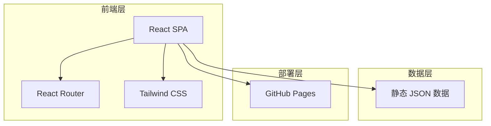
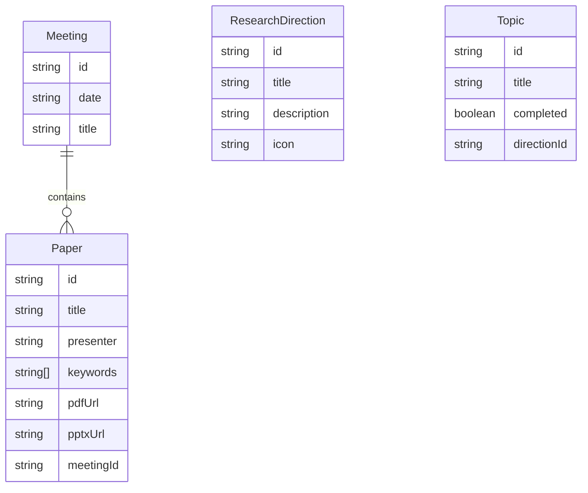

## 1. 架构设计

## 2. 技术说明

- **前端**：React@18 + Tailwind CSS@3 + Vite
- **初始化工具**：vite-init (react-ts 模板)
- **后端**：无（纯静态站点）
- **数据**：静态 JSON 文件存储组会数据，前端直接读取
- **部署**：GitHub Pages，使用 `gh-pages` 分支或 Actions 部署

## 3. 路由定义

| 路由 | 用途 |
|------|------|
| `/` | 首页，展示课题组概况和最新动态 |
| `/meetings` | 组会记录页，时间线展示所有组会 |
| `/research` | 研究方向页，展示研究方向和课题进展 |

## 4. 数据模型

### 4.1 数据模型定义

### 4.2 数据定义

组会数据以 JSON 文件形式存储于 `src/data/` 目录下：

- `meetings.json`：组会列表及关联论文
- `research.json`：研究方向及课题清单
